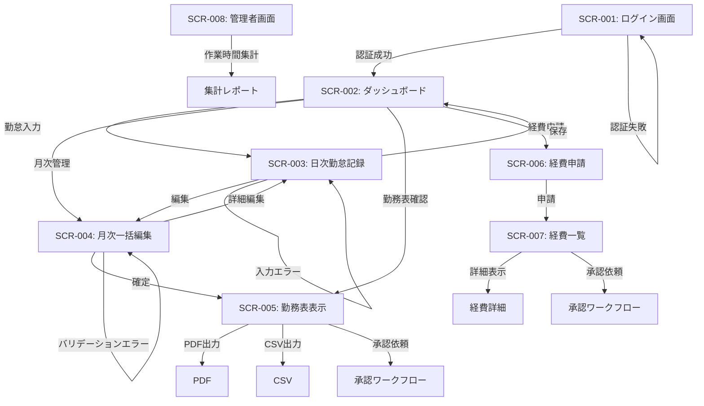

# Stamper - 画面構成仕様書

## 1. はじめに

### 1.1. 目的
本ドキュメントは、勤怠管理・経費申請システム「Stamper」の画面構成とUI/UX仕様を定義するものである。開発チームがユーザー体験を共通理解し、一貫性のあるインターフェースを実装するためのガイドラインとして利用する。

### 1.2. 適用範囲
このドキュメントは、Stamperの全画面に適用される。要件定義書に記載された機能要件（F-001〜F-017）に対応する画面設計を行い、次工程の詳細設計・実装の基礎となる。

### 1.3. システム概要
Stamperは、従来のスプレッドシートベースの勤怠管理とBacklog+Excelベースの経費申請を統合し、効率化するWebアプリケーションである。直感的なUIで誰でも簡単に利用でき、データの正確性を担保する。

## 2. 全体設計方針

### 2.1. デザインシステム
- **デザイン原則**: シンプル、直感的、一貫性を重視
- **レスポンシブ設計**: PC、タブレット、スマートフォンに対応
- **アクセシビリティ**: WAI-ARIA準拠、色覚多様性への配慮

### 2.2. 基本レイアウト
- **ヘッダー**: ロゴ、ユーザー情報、通知アイコン、設定アイコン
- **サイドバー**: 主要機能へのナビゲーション
- **メインコンテンツエリア**: 各機能の主要コンテンツ
- **フッター**: コピーライト、バージョン情報

### 2.3. 色彩計画
- **プライマリカラー**: #3E7BFA（青）- 信頼感、安心感
- **セカンダリカラー**: #00C49A（緑）- 成長、達成
- **アクセントカラー**: #FF6B6B（赤）- 重要通知、警告
- **ニュートラルカラー**: #F9F9F9, #EEEEEE, #999999, #333333

### 2.4. タイポグラフィ
- **本文**: Noto Sans JP（日本語）/ Roboto（英数字）
- **見出し**: Noto Sans JP Bold（日本語）/ Roboto Bold（英数字）
- **サイズ階層**: h1: 24px, h2: 20px, h3: 18px, 本文: 16px, 小文字: 14px

## 3. 画面遷移図

## 4. 共通コンポーネント

### 4.1. ナビゲーション
- **主要ナビゲーション**: ダッシュボード、勤怠記録、月次編集、勤務表、経費申請
- **ユーザーメニュー**: プロフィール、設定、ログアウト
- **パンくずリスト**: 現在位置の表示（3階層以上の画面遷移時に表示）

### 4.2. フォームコンポーネント
- **テキスト入力**: 標準、必須、エラー状態の3種類
- **セレクト（ドロップダウン）**: 単一選択、複数選択、階層選択
- **日付選択**: カレンダーピッカー
- **時間入力**: 数値スピナーまたは時刻選択
- **ボタン**: プライマリ、セカンダリ、テキストリンク、アイコンボタンの4種類

### 4.3. データ表示コンポーネント
- **テーブル**: ソート可能、フィルター可能
- **カード**: 情報の要約表示
- **グラフ**: 棒グラフ、円グラフ、折れ線グラフ
- **バッジ**: ステータス表示（未提出、承認待ち、承認済み、差戻し）

### 4.4. モーダル・ダイアログ
- **確認ダイアログ**: 重要なアクションの確認
- **編集モーダル**: フォーム入力用の大型モーダル
- **通知トースト**: 一時的なフィードバック表示

## 5. 業務ルール

### 5.1. 勤怠計算ルール
- **標準勤務時間**: 7.5時間/日
- **始業時間**: 月曜日 9:00、火〜金曜日 9:30
- **定時**: 18:00
- **休憩時間**:
  - 標準: 1時間（12:00-13:00）
  - 残業時（18:00以降）: 追加30分
- **残業計算**: 18:00以降の勤務を残業として計算
- **深夜残業**: 22:00以降の勤務を深夜残業として計算

### 5.2. 作業項目体系
- **大分類**: 所属部署（例: 開発部、営業部、管理部）
- **中分類**: プロジェクト名（例: Stamper開発、クライアントA案件）
- **小分類**: タスク名（例: 要件定義、設計、コーディング、テスト）

### 5.3. 休暇区分
- **全休**: 1日（7.5時間）単位の休暇
- **時間休**: 0.5時間単位で設定可能な休暇

## 6. 機能別画面設計

### 6.1. ログイン画面
- **画面ID**: SCR-001
- **概要**: ユーザー認証を行い、システムへのアクセス権を確認する
- **対応機能要件**: F-001
- **主要コンポーネント**:
  - Stamperロゴ
  - ユーザーID（メールアドレス）入力欄
  - パスワード入力欄
  - ログインボタン
  - パスワードリセットリンク
  - ヘルプリンク
- **振る舞い**:
  - 認証成功: ダッシュボード画面へ遷移
  - 認証失敗: エラーメッセージを表示
- **非機能要件**:
  - Amazon Cognito認証基盤を利用
  - パスワード強度のリアルタイム検証

### 6.2. ダッシュボード画面
- **画面ID**: SCR-002
- **概要**: ユーザーの勤怠・経費情報のサマリーを提供
- **対応機能要件**: F-002
- **主要コンポーネント**:
  - ヘッダー
    - アプリケーションタイトル
    - メインナビゲーション（ダッシュボード、時間記録、勤務表、一括編集）
  - 今月のサマリーセクション
    - 年月表示（例：2025年9月）
    - 週単位のサマリー
      - 週ごとの合計作業時間リスト（月曜〜日曜）
      - 月跨ぎ週の表示（例：9/29〜10/5）
    - 作業項目別合計時間
      - 小分類ごとの集計表示
    - 残業時間
      - 通常残業時間合計
      - 深夜残業時間合計
    - 休暇取得状況
      - 全休日数（D表記）
      - 時間休合計時間（h表記）
  - 申請セクション
    - 経費申請ボタン（アイコン付き）
- **振る舞い**:
  - データロード中はローディングインジケータ表示
  - ナビゲーションボタンによる画面切り替え
  - 経費申請ボタンから経費申請画面へ遷移
- **非機能要件**:
  - レスポンシブグリッドレイアウト（小画面では縦並び、大画面では4カラム表示）
  - データ読み込み時はスケルトンローディング表示
  - 月跨ぎ週の正確な集計

### 6.3. 日次勤怠記録画面
- **画面ID**: SCR-003
- **概要**: 日々の作業内容と時間を記録する
- **対応機能要件**: F-003, F-004, F-005, F-006
- **主要コンポーネント**:
  - ヘッダー部分
    - 「時間記録」タイトル
    - 日付選択フィールド（日付ピッカー）
  - 作業項目入力セクション
    - 作業項目入力エリア（複数追加可能）
      - 分類選択部分（3カラムグリッド）
        - 大分類ドロップダウン（所属部署）
        - 中分類ドロップダウン（プロジェクト）
        - 小分類ドロップダウン（案件名）
      - 作業時間入力部分
        - 作業時間数値入力（0.25時間単位）
        - 項目削除ボタン（ゴミ箱アイコン）
  - 作業項目追加ボタン
    - アイコン付きの「作業項目を追加」ボタン
  - 休暇設定セクション
    - 「休暇にする」チェックボックス
    - 休暇タイプ選択ドロップダウン
      - 全休（7.5h）
      - 時間休
    - 時間休入力フィールド（休暇タイプが時間休の場合のみ表示）
  - 自動計算結果表示セクション（F-006）
    - 入力した作業時間と休暇時間から算出した勤務情報の表示
    - 作業時間合計
    - 休暇時間（時間休の場合）
    - 始業時間（曜日に基づき自動設定）
    - 終業時間（作業時間と休憩時間から算出）
    - 休憩時間（標準/残業時の追加休憩を表示）
    - 残業時間内訳（通常/深夜）
  - アクション部分
    - 保存ボタン
- **振る舞い**:
  - 休暇設定の動作
    - 「休暇にする」にチェックした場合、休暇タイプを選択可能になる
    - 休暇タイプ「全休」選択時は作業項目入力部分が非表示になる（7.5時間の休暇として記録）
    - 休暇タイプ「時間休」選択時は、時間休入力フィールドが表示され、かつ作業項目入力も可能となる
  - 作業項目操作
    - 休暇タイプが「全休」でない場合は作業項目が追加可能
    - 作業項目の削除が可能
  - 入力内容を保存すると、成功メッセージを表示
- **非機能要件**:
  - レスポンシブ対応（モバイルでは縦並びレイアウト）
  - 数値入力は0.25時間刻み
  - フォーム要素は視覚的にわかりやすいグルーピング

### 6.4. 月次一括編集画面
- **画面ID**: SCR-004
- **概要**: 月間の勤怠データを一覧表示し、効率的に編集する
- **対応機能要件**: F-007
- **主要コンポーネント**:
  - ヘッダー部分
    - 「一括編集」タイトル
    - 年月表示（例：2025年9月）
  - 勤怠データテーブル
    - 横スクロール可能なテーブルレイアウト
    - ヘッダー行
      - 日付列
      - 曜日列
      - 記録された作業列
      - 合計時間列
      - アクション列
    - データ行
      - 日付（MM/DD形式）
      - 曜日（一文字表示）
      - 作業記録詳細（箇条書き形式）
        - 「大 > 中 > 小: XX.Xh」形式で各作業項目を表示
        - 全休の場合は「(全休)」と表示
        - 時間休の場合は「(時間休: X.Xh)」に加え、作業項目も表示
      - 合計作業時間（等幅フォントで時間表示）
      - 編集ボタン（各行に対応）
  - アクション部分
    - 一括保存ボタン
- **振る舞い**:
  - 編集ボタンクリックで該当日の編集モーダルを表示
  - 編集モーダルでは日次勤怠記録と同様の入力が可能
    - 時間休の場合、休暇時間と作業時間を併せて入力可能
    - 全休の場合は作業項目入力フィールドが非表示
  - 行にマウスを乗せると背景色が変わりハイライト表示
  - 一括保存ボタンで全ての変更をまとめて保存
- **非機能要件**:
  - 横スクロール対応によるモバイル対応
  - 情報の階層表示（作業記録は小さなフォントでコンパクト表示）
  - 等幅フォントによる数値の視認性確保

### 6.5. 勤務表表示画面
- **画面ID**: SCR-005
- **概要**: 月間の勤務実績を公式フォーマットで表示する
- **対応機能要件**: F-008, F-013
- **主要コンポーネント**:
  - ヘッダー部分
    - 「勤務表」タイトル
    - 年月表示（例：2025年9月）
  - 勤務表テーブル
    - 横スクロール可能なテーブルレイアウト
    - ヘッダー行（軽量グレー背景）
      - 日付列
      - 曜日列
      - 開始時間列
      - 終了時間列
      - 休憩時間列
      - 合計作業時間列
      - 作業内容列
    - データ行
      - 各日の勤怠情報
      - JavaScript処理で動的に生成される
  - テーブルボディ
    - 行ホバー時にハイライト表示
- **振る舞い**:
  - テーブル内容はサーバーから取得したデータに基づき自動生成
  - 作業内容は小分類の項目がカンマ区切りで表示
  - 開始・終了・休憩時間は勤怠計算ルールに基づき自動計算
- **非機能要件**:
  - 横スクロール対応によるモバイル対応
  - テキストを左揃えで表示し可読性を確保
  - ホワイトスペースを保持し、長い内容でも改行されないよう設計

### 6.6. 経費申請画面
- **画面ID**: SCR-006
- **概要**: 領収書をアップロードし、経費申請データを作成する
- **対応機能要件**: F-009, F-010, F-012
- **主要コンポーネント**:
  - 申請情報入力
    - 申請日（デフォルトは当日）
    - 申請タイトル
    - 申請者情報（自動入力）
  - 領収書アップロードエリア
    - ドラッグ&ドロップエリア
    - ファイル選択ボタン
    - アップロード済み領収書サムネイルリスト
  - OCR解析結果表示・編集セクション
    - 日付（OCR結果＋手動修正可）
    - 支払先（OCR結果＋手動修正可）
    - インボイス番号（OCR結果＋手動修正可）
    - 適用（手動入力）
    - 金額（OCR結果＋手動修正可）
    - 税区分（選択）
  - 複数領収書集計表
  - 申請ボタン
  - 下書き保存ボタン
- **振る舞い**:
  - 領収書アップロード後、自動でOCR解析開始
  - 解析中はローディング表示
  - OCR結果は編集可能
  - 複数領収書の合計金額を自動計算
- **非機能要件**:
  - 対応ファイル形式：PNG, JPEG, PDF
  - 最大ファイルサイズ：10MB
  - OCR解析精度向上のためのプレビュー＋調整機能

### 6.7. 経費一覧・詳細画面
- **画面ID**: SCR-007
- **概要**: 申請済み経費の一覧と詳細を表示する
- **対応機能要件**: F-012, F-013
- **主要コンポーネント**:
  - フィルター条件
    - 期間（年月選択）
    - ステータス（全て/下書き/申請中/承認済/差戻し）
  - 経費一覧テーブル
    - 申請日列
    - 申請タイトル列
    - 合計金額列
    - ステータス列
    - アクション列
  - 詳細表示エリア（選択時）
    - 申請情報
    - 領収書画像
    - 経費明細
    - 承認履歴
  - アクションボタン
    - 編集ボタン（下書き/差戻し時のみ）
    - 削除ボタン（下書き時のみ）
    - 再申請ボタン（差戻し時のみ）
- **振る舞い**:
  - 一覧の行選択で詳細表示
  - ステータスに応じてアクションボタンの表示/非表示を制御
  - 承認済み経費は参照のみ可能
- **非機能要件**:
  - 一覧の無限スクロール
  - 詳細画像のズーム表示

### 6.8. 管理者画面 - 作業時間集計
- **画面ID**: SCR-008
- **概要**: 管理者向けのチームメンバーの作業時間集計を表示する
- **対応機能要件**: F-014
- **主要コンポーネント**:
  - フィルター条件
    - 期間（年月選択）
    - 部署選択
    - プロジェクト選択
    - メンバー選択
  - 集計条件選択
    - 日別/週別/月別
    - 部署別/プロジェクト別/メンバー別
  - 集計データグラフ表示
  - 集計データテーブル
  - CSV出力ボタン
- **振る舞い**:
  - フィルター条件変更時に自動再集計
  - グラフとテーブルの連動表示
- **非機能要件**:
  - 大量データの高速集計処理
  - グラフのインタラクティブ操作

### 6.9. 管理者画面 - 作業項目管理
- **画面ID**: SCR-009
- **概要**: 作業項目の大・中・小分類を設定・管理する
- **対応機能要件**: F-015
- **主要コンポーネント**:
  - 作業項目階層表示
    - ツリー形式での大・中・小分類の関係表示
    - 階層ごとの展開・折りたたみ機能
  - 作業項目編集フォーム
    - 大分類（部署）入力・編集
    - 中分類（プロジェクト）入力・編集
    - 小分類（タスク）入力・編集
    - 有効/無効フラグ設定
    - 表示順序設定
  - アクションボタン
    - 新規項目追加ボタン
    - 保存ボタン
    - 削除ボタン
- **振る舞い**:
  - ドラッグ＆ドロップによる階層間の項目移動
  - 項目の編集・保存後、即時に反映
  - 使用中の項目を無効化する際の警告表示
- **非機能要件**:
  - 大量の作業項目の高速表示
  - 変更履歴の保持（監査証跡）

### 6.10. 勤怠承認画面
- **画面ID**: SCR-010
- **概要**: 管理者が部下の勤怠申請を確認し、承認または差し戻しを行う
- **対応機能要件**: F-011
- **主要コンポーネント**:
  - 申請一覧セクション
    - フィルター条件（申請者、期間、ステータス）
    - 申請一覧テーブル
      - 申請者名列
      - 対象月列
      - 申請日列
      - ステータス列
      - アクション列
  - 勤怠内容確認セクション
    - 申請者情報
    - 対象月勤務表（読み取り専用）
    - 月間サマリー情報
      - 合計勤務時間
      - 残業時間
      - 休暇取得状況
  - アクションボタン
    - 承認ボタン
    - 差戻しボタン（コメント入力欄付き）
    - 詳細PDF表示ボタン
- **振る舞い**:
  - 申請一覧から選択した申請の詳細を表示
  - 承認/差戻しボタン押下で確認ダイアログを表示
  - 承認/差戻し後はステータスが更新され、申請者に通知が送信される
- **非機能要件**:
  - 複数申請の一括承認機能
  - 承認履歴の保存と監査証跡

## 7. 画面遷移詳細

### 7.1. 通常フロー
1. ログイン画面 → ダッシュボード
2. ダッシュボード → 各機能画面（日次勤怠記録/月次一括編集/勤務表/経費申請）
3. 日次勤怠記録 → 保存後ダッシュボードに戻る
4. 月次一括編集 → 日次勤怠記録モーダル → 保存して月次一括編集に戻る
5. 経費申請 → 申請後経費一覧に遷移

### 7.2. 例外フロー
1. ログイン失敗 → エラーメッセージ表示 → ログイン画面に留まる
2. 未入力必須項目がある場合 → エラーメッセージ表示 → 同画面に留まる
3. バリデーションエラー → 対象項目にエラー表示 → 同画面に留まる
4. セッションタイムアウト → ログイン画面に戻る（作業中データは自動保存）

## 8. レスポンシブ設計

### 8.1. ブレークポイント定義
- **スマートフォン**: 〜767px
- **タブレット**: 768px〜1023px
- **デスクトップ**: 1024px〜

### 8.2. デバイス別UI調整
- **スマートフォン**:
  - サイドバーをハンバーガーメニューに変更
  - テーブルを縦スクロール可能なカード形式に変更
  - 入力フォームを縦長レイアウトに再構成
- **タブレット**:
  - 2段カラムレイアウトに縮小
  - サイドバーを最小化
- **デスクトップ**:
  - 3段カラムレイアウト
  - サイドバーを常時表示

## 9. 今後の拡張予定

### 9.1. 将来実装機能
- 打刻機能（F-016）: 出勤・退勤ボタンによる時刻記録
- リマインダー機能（F-017）: メール通知による入力漏れ防止
- 申請・承認ワークフロー詳細化（F-011, F-012）
- チームカレンダービュー: メンバーの予定把握

### 9.2. 外部システム連携
- 人事システムとの連携
- 会計システムとの連携
- カレンダーサービスとの連携
