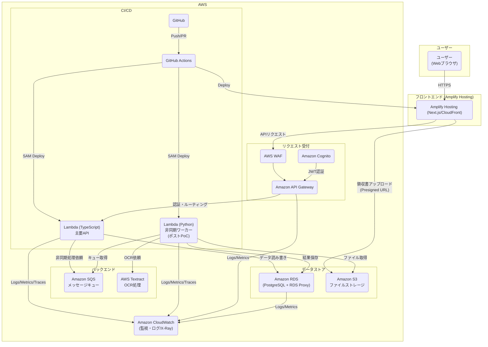
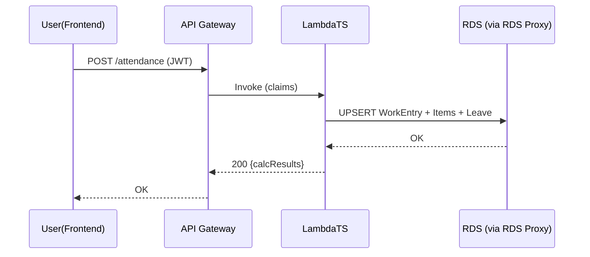
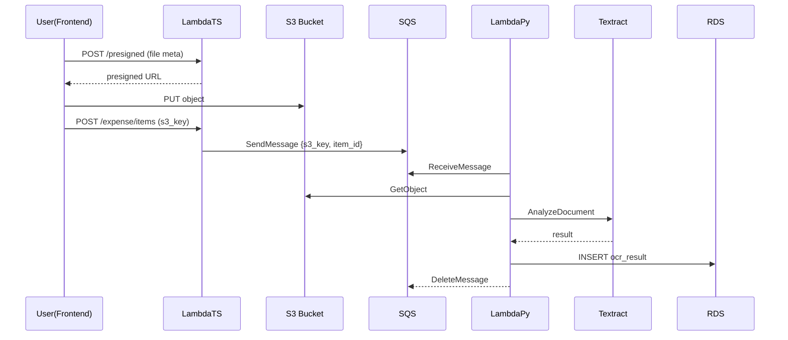

# アーキテクチャ設計書：Stamper

## 1. 背景と目的
* 背景：現状の勤怠はスプレッドシート、経費はBacklog+Excelで個別管理され、入力ミスや集計の手間が多い。リモートワークの普及に伴い、どこからでも簡便かつ正確に記録・承認できる仕組みが必要。
* 目的：勤怠・経費・領収書管理を統合した社内Webアプリをサーバレスで実装し、チームリーダーの集計工数を削減し、UXを向上。
* ゴール（要件 #1_requirements.md から抜粋）：
    - 2週間でPoCの勤怠管理基本機能を実装、フィードバック取得。
    - 勤怠集計作業時間を75%削減。
    - 直感的UIでマニュアル不要、集計ミスゼロを目指す。

## 2. アーキテクチャ全体像
* アーキテクチャスタイル：フロントエンドはNext.js、バックエンドはAWSサーバレス（API Gateway + Lambda + RDS + S3 + SQS + Textract）。認証はCognito。監視はCloudWatch。IaCはAWS SAM（PoC段階）。
* ホスティング：フロントはAWS Amplify Hosting（CloudFront配下）を採用。Preview/Production運用が容易。必要に応じてブランチごとに環境を自動生成。

### フェーズ定義（PoC前提）
* PoCスコープ：勤怠（F-002〜F-008）のみ。経費/OCR（F-009〜F-012）、承認ワークフロー（F-011, F-012）はポストPoC。
* セキュリティ：CloudFront + WAF によりフロント(Amplify)にもIP許可リストを適用。API層もWAFで社内IP制限を実施し二重で防御。Cognito Hosted UI を併用。
* 認証：Cognito Hosted UI（SSOはポストPoC）。
* 環境：単一AWSアカウントで dev/stg/prod を分離（将来はアカウント分離）。
* 規模：PoCユーザー<=10名（将来50名想定）。RDSは最小クラスで開始。



### 設計方針
* マネージドサービスを優先採用し、運用負荷低減と弾力的なスケールを実現。
* UI/バックエンド/非同期処理の責務を分離し、変更容易性を高める。
* 型共有（packages/types）によりFE/BE間の契約整合を担保。

## 3. 論理ビュー
### 機能モジュール
- 認証・認可：Cognito + API Gateway JWTオーソライザ
- 勤怠登録（日次・月次・自動計算）：WorkEntry、WorkItem、LeaveRecord集約
- 勤務表表示/出力：Timesheetビュー、集計ロジック
- 経費申請・領収書：ExpenseClaim、ExpenseItem、ReceiptFile、OCR結果
- 申請・承認（将来拡張）：ApprovalRequest、ApprovalAction
- 管理者レポート/作業項目管理：Aggregation、Master（Department/Project/Task）

### ドメインモデル（ER 概略）
```mermaid
erDiagram
        USER ||--o{ WORK_ENTRY : creates
        USER ||--o{ EXPENSE_CLAIM : submits
        DEPARTMENT ||--o{ PROJECT : contains
        PROJECT ||--o{ TASK : contains

        WORK_ENTRY ||--o{ WORK_ITEM : has
        WORK_ENTRY ||--o{ LEAVE_RECORD : may_have
        WORK_ENTRY {
            uuid id PK
            uuid user_id FK
            date work_date
            decimal total_hours
            boolean is_holiday
            timestamptz created_at
            timestamptz updated_at
        }
        WORK_ITEM {
            uuid id PK
            uuid work_entry_id FK
            uuid department_id FK
            uuid project_id FK
            uuid task_id FK
            decimal hours
        }
        LEAVE_RECORD {
            uuid id PK
            uuid work_entry_id FK
            text leave_type  // full, hourly
            decimal hours    // hourly only
        }
        EXPENSE_CLAIM ||--o{ EXPENSE_ITEM : has
        EXPENSE_ITEM ||--o{ RECEIPT_FILE : attaches
        RECEIPT_FILE ||--o| OCR_RESULT : produces
        EXPENSE_CLAIM {
            uuid id PK
            uuid user_id FK
            date applied_on
            text title
            text status  // draft, submitted, approved, returned
            numeric total_amount
        }
        EXPENSE_ITEM {
            uuid id PK
            uuid claim_id FK
            date occurred_on
            text payee
            text invoice_no
            text description
            numeric amount
            text tax_category
        }
        RECEIPT_FILE {
            uuid id PK
            uuid expense_item_id FK
            text s3_key
            text content_type
            integer size
        }
        OCR_RESULT {
            uuid id PK
            uuid receipt_file_id FK
            jsonb raw_json
            date detected_date
            text detected_payee
            text detected_invoice_no
            numeric detected_amount
            float confidence
        }
```

### 入出力契約（例）
- Presigned URL 発行: input={contentType, size}, output={url, fields, key, expiresAt}
- 勤怠保存 API: input={date, workItems[], leave}, output={id, calcResults}
- 経費申請保存: input={items[], title}, output={claimId, total}

## 4. 開発ビュー
### モノリポ構成（Turborepo）
```
apps/
    frontend/        # Next.js 14
    backend-ts/      # SAM TypeScript Lambdas (REST API, presigned URL, business logic)
    backend-py/      # SAM Python Lambdas (SQS worker, Textract orchestration)
packages/
    types/           # OpenAPI/TS types shared between FE/BE
    tsconfig/        # shared tsconfig
    eslint-config/   # shared lint rules
```

### 主なモジュール
- backend-ts
    - handlers/auth.ts (Cognito連携)
    - handlers/attendance.ts（F003-007）
    - handlers/timesheet.ts（F008, F013）
    - handlers/expense.ts（F009-012）
    - handlers/upload.ts（S3 presigned）
    - lib/db.ts（Kysely + node-postgres + RDS Proxy）
    - lib/validation.ts（Zod）
    - lib/observability.ts（構造化ログ、X-Ray）
- backend-py
    - worker/ocr_consumer.py（SQSポーリング、Textract、結果保存、DLQ）
    - lib/s3.py, lib/rds.py
- frontend
    - app/(routes)/... 各画面（#2_Screen.md 準拠）
    - api client（OpenAPI生成 or hand-written fetch with types）

### コーディング規約/ツール
- TypeScript strict、ESLint+Prettier、Jest + Playwright、Commitlint/Conventional Commits
- マイグレーション：Kysely Migrations（CI で apply）、UUID v4 主キー
- DB接続：RDS Proxy 経由、コネクション数抑制

## 5. プロセスビュー
### シーケンス（勤怠保存）


### シーケンス（領収書アップロード→OCR）

注記：本シーケンスはポストPoC。PoC期間は実装対象外。

### 並行性・スケジューリング
- Lambda 同時実行はデフォルトでスケールアウト。RDS保護のため RDS Proxy を必須化、DB同時接続上限を調整。
- SQS可視性タイムアウトと再試行/バックオフ、DLQ（最大受信回数超）を設定。
- Idempotency キー（item_id, s3_key）で重複投入ガード。

### 失敗時動作
- OCR失敗はDLQへ。CloudWatch Alarm + Slack通知（EventBridge → ChatOps）。
- APIはバリデーションエラー400、認可エラー403/401、システムエラー5xx。構造化エラーコードを定義。

## 6. 物理ビュー
### インフラ配置（AWS）
- アカウント/環境：dev / stg / prod（将来はアカウント分離）。リージョンは ap-northeast-1 を想定。
- VPC：プライベートサブネット（Lambda, RDS, RDS Proxy）。RDSはMulti-AZ。
- VPCエンドポイント：S3 Gateway、SQS/SecretsManager/KMS/Logs（Interface）を設定し、NAT不要構成を優先。
- API Gateway：カスタムドメイン + WAF。Cognito JWT オーソライザ。
- RDS PostgreSQL：暗号化（KMS）、自動バックアップ、パラメタグループ調整。
- RDS Proxy：コネクションプーリング、IAM認証（推奨）。
- S3：専用バケット（receipt-<env>）、バケットポリシー、ブロックPublicAccess、有効なライフサイクル（原本/サムネ/アーカイブ）。
- Secrets：Secrets Manager（DB資格情報）+ 自動ローテーション、Parameter Store（アプリ設定）。
- 監視：CloudWatch Logs/Metric Filters、X-Ray、Alarms、Dashboards。
- ドメイン：Route53（api.example.co.jp, app.example.co.jp）。Amplify Hosting の CloudFront ディストリビューションに独自ドメイン/CNAMEとACM証明書を適用。
 - WAF IP制限：API GatewayにIPセットで社内グローバルIPのみ許可。加えてCloudFront（Amplify配下）にもWebACLを関連付け、フロント配信にも同様の制限を適用。

### デプロイメント図（簡略）
```mermaid
graph LR
        subgraph VPC
            subgraph PrivateSubnets
                L1(LambdaTS)
                L2(LambdaPy)
                RP(RDS Proxy)
                DB[(RDS PostgreSQL Multi-AZ)]
            end
            VPCE[(VPC Endpoints: S3, SQS, SM, KMS, Logs)]
        end
        APIGW{{API Gateway}} --> L1
        SQS{{SQS}} --> L2
        L1 --> RP --> DB
        L2 --> RP --> DB
        L2 -->|Get/Put| S3[(S3 Bucket)]
        WAF{{WAF}} --> APIGW
        Cognito{{Cognito}} --> APIGW
        Frontend[[Amplify Hosting (CloudFront)]] -->|HTTPS| APIGW
```

## 7. 非機能要件対応
| 種別 | 設計上の考慮点 |
|---|---|
| パフォーマンス | Lambdaのメモリ/CPU最適化、RDS Proxyで接続制御、DAX不要・SQL最適化、主要API p95<3s（NF-001）。PoCは同時実行<=10、RDS接続上限を小さく設定 |
| 可用性 | RDS Multi-AZ、SQS冗長、Lambda/AZ冗長、ステートレス、デプロイは段階的リリース|
| セキュリティ | Cognito + JWT、WAF（IP許可リスト）、KMS暗号化（RDS/S3）、最小権限IAM、Secrets Managerローテーション、監査ログ|
| スケーラビリティ | サーバレスで自動スケール、SQSでピークバッファ、水平分割しやすいドメイン境界|
| 運用性 | 構造化ログ(JSON)、相関ID、X-Rayトレース、CloudWatch Alarm→Slack（AWS Chatbot or Webhook）、IaC（SAM）、Runbook整備|

## 8. 技術選定
| 領域 | 採用技術 | 代替候補 | 選定理由 | リスク |
|---|---|---|---|---|
| DB | Amazon RDS for PostgreSQL + RDS Proxy | Aurora Serverless v2, DynamoDB | リレーショナル/集計/レポート適性、既存スキル | 接続数/スケール制約→Proxy必須、コスト|
| API | API Gateway + Lambda (TypeScript, SAM) | App Runner, ECS Fargate, SST/CDK | 運用負荷小・細粒度スケール・PoC速度 | コールドスタート、DB接続最適化必要|
| UIフレームワーク | Next.js 14 (Amplify Hosting) | Vercel, SvelteKit, Nuxt | 生産性・Preview・SSR/SSG柔軟性・AWS統合 | 設定の複雑さ、CloudFront/WAF管理|
| 非同期/ワーカー | SQS + Lambda (Python) + Textract | Step Functions, EventBridge Pipes | シンプル/低コストに開始できる | 複雑化時はオーケストレーション再設計が必要|
| 認証 | Amazon Cognito (User Pool + Hosted UI) | Auth0, Azure AD B2C, Google SSO | AWS統合とコスト、PoCに十分 | エンタープライズSSO拡張時のUX差異|
| IaC | AWS SAM | CDK, Serverless Framework, Terraform | 学習コスト低・Lambda中心に最適 | 複合リソース/多言語化でテンプレ拡散|
| ORM/DB | Kysely + node-postgres | Prisma(Data Proxy), Knex, Sequelize | 軽量・Lambda適性・型安全 | クエリ最適化/マイグレーション設計の責務増|
| 監視 | CloudWatch + X-Ray + Slack通知 | Datadog, New Relic | まずはAWS標準で十分 | 組織横断の統合可観測性は限定的|

### サイジング（PoC初期値）
- Lambda 予約同時実行：backend-ts 合計 10、timeout 10s（出力系は20sまで）。
- RDS：db.t4g.micro（スモールスタート）、max_connections をRDS Proxy前提で抑制。
- SQS：標準キュー、可視性タイムアウト 60s、最大受信回数 5、DLQ 有効（ポストPoC適用）。
- CloudWatch アラーム：5xxレート、レイテンシ、スロットリング、RDS CPU/コネクション。通知はSlack（チャンネルは後日確定）。

## 9. 設計判断ログ
1. サーバレス採用：短期PoCでのスピードと運用負荷を重視。代替のECSは初期構築が重く却下。
2. RDS選択：集計/レポート要件（F-002, F-008, F-014）に強い。DynamoDBは集計の複雑性が高く今回は不採用。
3. 非同期基盤：まずSQSで十分。将来的に分岐/人手判断が増えたらStep Functions検討。
4. OCR：TextractはAWS統合と領収書の精度/コストバランスが良い。他社APIはガバナンス面で見送り。
5. FEホスティング：Amplify Hosting を採用（AWS統合・セキュリティ/権限面の一貫性、CloudFrontベースのSSR/ISR対応）。
6. ORM：Lambda親和性からKysely。PrismaはData Proxy必須化・ネットワーク制約が増えるためPoCでは回避。
7. セキュリティ：WAF + Cognito JWT + 最小権限IAM + VPCエンドポイント優先でNAT排除しコスト/漏洩面積を削減。
8. Observability：まずCloudWatch/X-Ray。規模拡大時はDatadog等に移行可能な抽象化を意識。

## 10. 今後の課題と検討事項
* 申請・承認ワークフローの詳細設計（段階承認、代理承認、差戻し理由管理）
* データ保持/アーカイブ（NF-006に基づくS3 Glacier移行やRDSパーティショニング）
* 料金最適化（NAT排除・VPCエンドポイントの費用対効果、TextractのBatch/Async最適化）
* マルチアカウント/環境分離戦略、ガードレール（SCP, IAM Boundary）
* SSO連携（将来要件：Google Workspace/ADFS、Cognito IdP連携）
* アクセス監査・監査証跡（CloudTrail/Lake/ Athena での監査ビュー）
* テスト戦略の強化（契約テスト、耐障害性テスト、負荷テストの閾値策定）
* 例外系のUX（オフライン/再送/自動保存）


